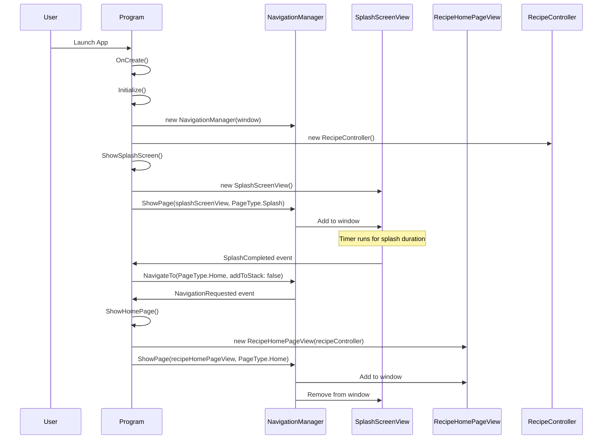
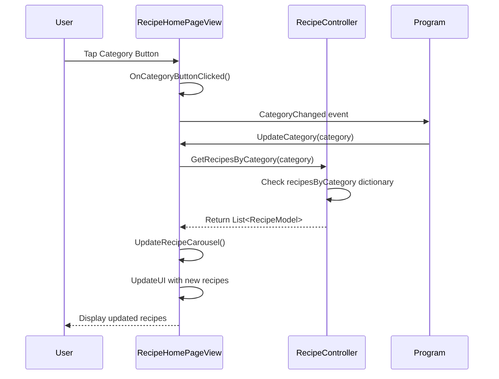
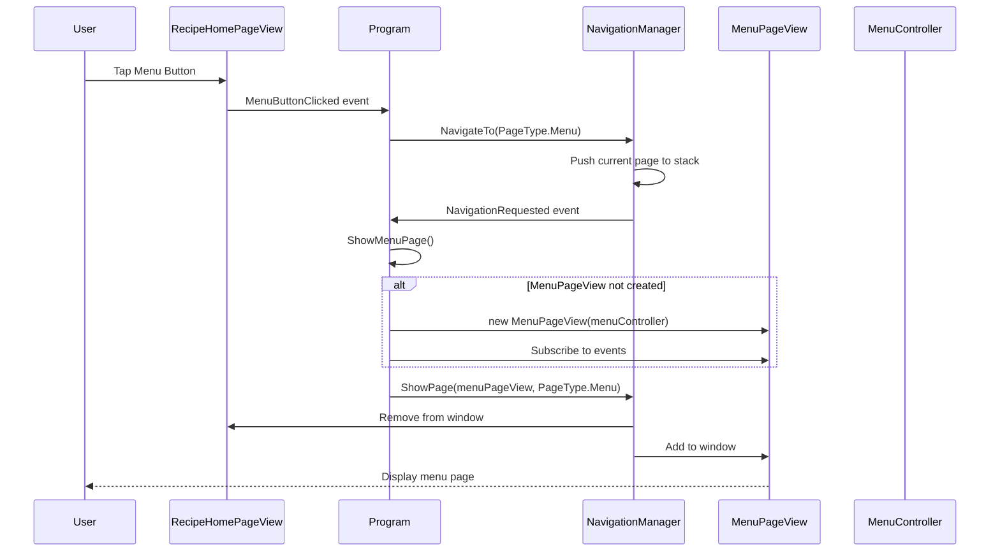
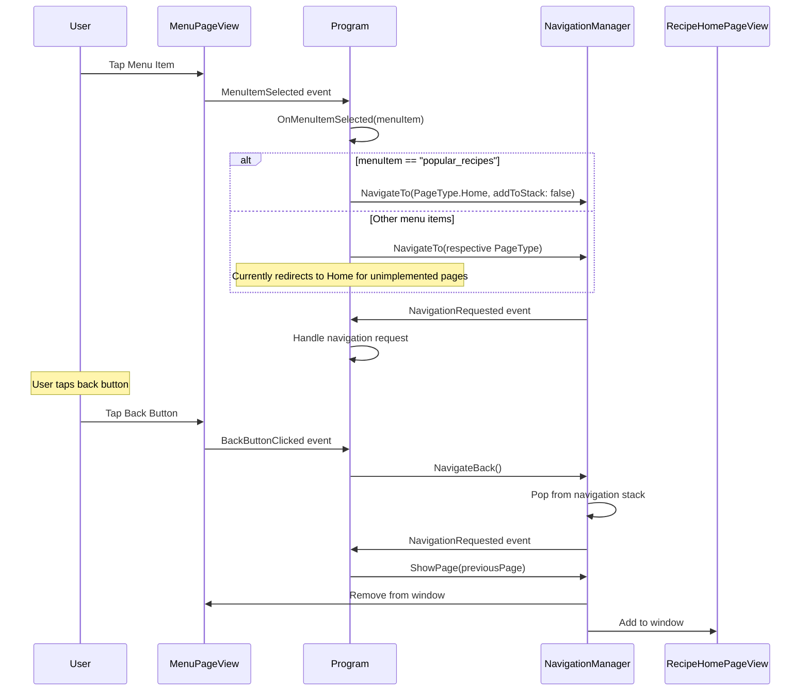
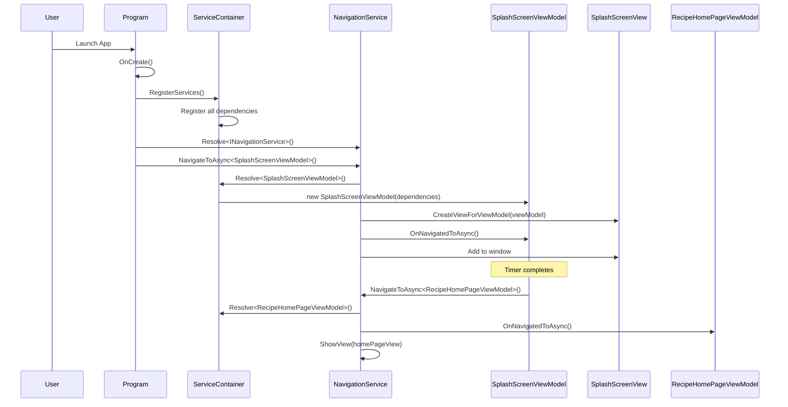
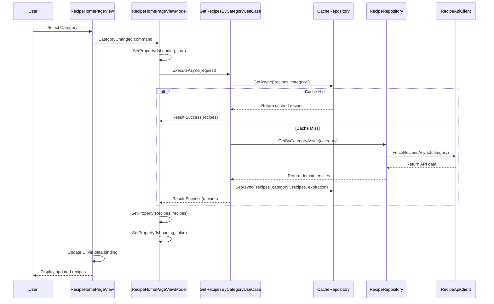
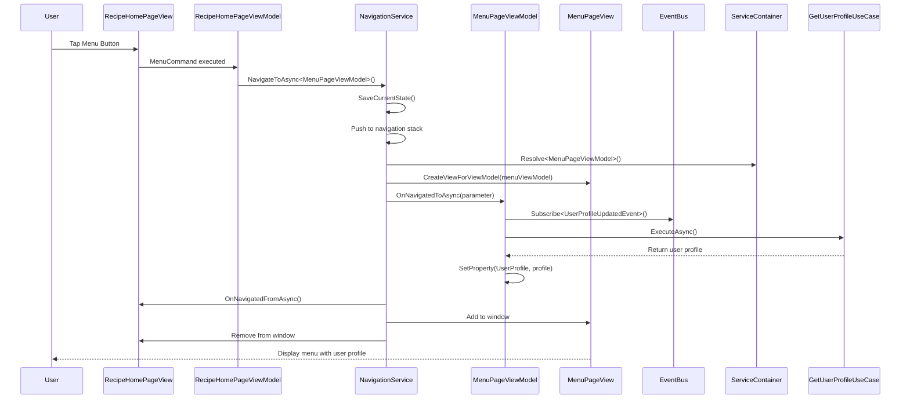
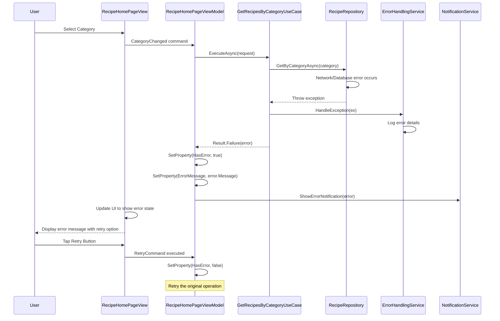
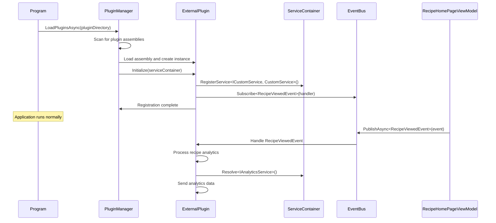
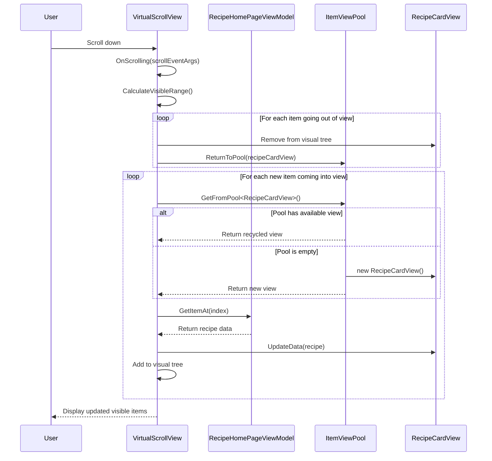

# Sequence Diagrams for TizenNUIApp Recipe Application

## Current Architecture Sequence Diagrams

### 1. Application Startup and Splash Screen Flow

### 2. Recipe Category Selection Flow

### 3. Navigation to Menu Page Flow

### 4. Menu Item Selection and Back Navigation Flow

## Proposed Architecture Sequence Diagrams

### 1. Enhanced Application Startup with Dependency Injection

### 2. Recipe Data Retrieval with Use Cases and Caching

### 3. Enhanced Navigation with State Management

### 4. Error Handling and Recovery Flow

### 5. Plugin Architecture Integration Flow

### 6. Virtual Scrolling Performance Optimization

## Key Improvements in Proposed Architecture

### 1. **Separation of Concerns**
- ViewModels handle presentation logic
- Use Cases encapsulate business logic
- Repositories manage data access
- Services provide cross-cutting concerns

### 2. **Async Operations**
- All data operations are asynchronous
- Non-blocking UI interactions
- Better error handling and recovery

### 3. **Dependency Injection**
- Loose coupling between components
- Easy testing and mocking
- Configurable service lifetimes

### 4. **Event-Driven Architecture**
- Decoupled communication via EventBus
- Plugin support through event subscriptions
- Better scalability and maintainability

### 5. **Performance Optimizations**
- Multi-level caching strategy
- Virtual scrolling for large lists
- Resource pooling and recycling
- Memory management improvements

### 6. **Error Handling**
- Consistent error handling patterns
- User-friendly error messages
- Automatic retry mechanisms
- Comprehensive logging

These sequence diagrams illustrate how the proposed architecture addresses the limitations of the current implementation while providing a foundation for scalable, maintainable, and performant application development.
